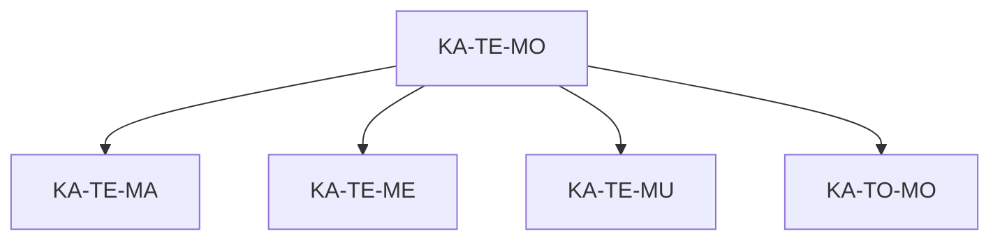
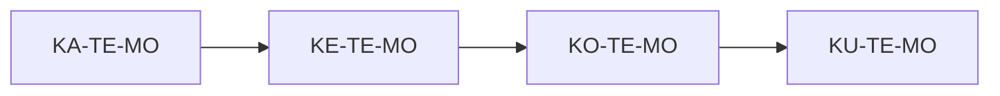
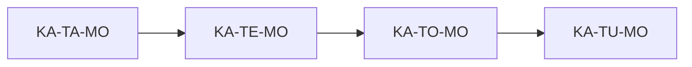
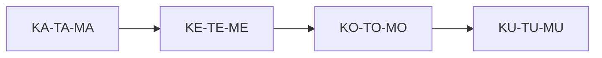
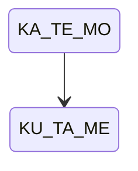
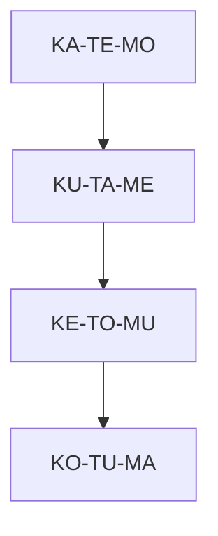
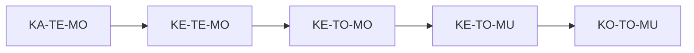

### **SUBIT‑Lingua v3.0 — Advanced Structural Diagrams**

This document provides **advanced, structural, process‑level diagrams** for SUBIT‑Lingua v3.0.  
These diagrams illustrate:

- transition networks  
- finite‑state machines  
- structural motifs  
- attractors and cycles  
- axis‑flows  
- higher‑order programs  
- bit‑geometry  
- lattice paths  

All diagrams are **text‑based** or **Mermaid‑compatible**.

---

# **1. Transition Network (Local Neighborhood)**

Each form has **6 neighbors** reachable by flipping one vowel‑bit pair.

Example center: `KA‑TE‑MO` (000110)

```
                 KA-TE-MU (000111)
                        ^
                        |
KA-TE-MA (000100) <--- KA-TE-MO ---> KA-TE-ME (000101)
                        |
                        v
                 KA-TO-MO (001010)
```

This is the **local transition graph** around a form.

Mermaid version:



---

# **2. Axis‑Flow Diagram (K‑axis sweep)**

```
KA‑TE‑MO → KE‑TE‑MO → KO‑TE‑MO → KU‑TE‑MO
```



This is a **pure K‑axis flow**: only the first vowel changes.

---

# **3. Axis‑Flow Diagram (T‑axis sweep)**

```
KA‑TA‑MO → KA‑TE‑MO → KA‑TO‑MO → KA‑TU‑MO
```



---

# **4. Axis‑Flow Diagram (M‑axis sweep)**

```
KA‑TE‑MA → KA‑TE‑ME → KA‑TE‑MO → KA‑TE‑MU
```

---

# **5. Diagonal Flow (3‑axis progression)**

A diagonal through the cube:

```
KA‑TA‑MA → KE‑TE‑ME → KO‑TO‑MO → KU‑TU‑MU
```



This is a **balanced structural progression** across all axes.

---

# **6. Finite‑State Machine (FSM) for a Word**

A word is a **transition**:

```
KA‑TE‑MO – KU‑TA‑ME
```

FSM representation:



This is the simplest SUBIT FSM: a **single directed edge**.

---

# **7. FSM for a Sequence**

Sequence:

```
KA‑TE‑MO → KU‑TA‑ME → KE‑TO‑MU
```

FSM:

```mermaid
stateDiagram-v2
    KA_TE_MO --> KU_TA_ME --> KE_TO_MU
```

This is a **linear process**.

---

# **8. Cyclic Motif (Loop)**

A cycle in form‑space:

```
KA‑TE‑MO → KE‑TE‑MO → KE‑TE‑ME → KA‑TE‑ME → KA‑TE‑MO
```

ASCII:

```
KA-TE-MO --> KE-TE-MO
     ^               |
     |               v
KA-TE-ME <-- KE-TE-ME
```

This is a **4‑form attractor cycle**.

---

# **9. Bit‑Geometry Diagram (Hamming Sphere)**

Center: `000110` (KA‑TE‑MO)

Hamming‑1 neighbors:

```
000111  KA‑TE‑MU
000100  KA‑TE‑MA
000101  KA‑TE‑ME
001110  KA‑TU‑MO
010110  KE‑TE‑MO
100110  KO‑TE‑MO
```

Diagram:

```
          000111
             |
000100 -- 000110 -- 000101
             |
          001110
```

---

# **10. 12‑Bit Word Geometry**

A word is a point in a **12‑bit lattice**.

Example:

```
000110110001
```

Split:

```
000110 | 110001
```

Geometry:

```
Inner form: 000110 (KA‑TE‑MO)
Outer form: 110001 (KU‑TA‑ME)
```

ASCII:

```
+--------+--------+
| 000110 | 110001 |
+--------+--------+
```

---

# **11. Higher‑Order Program Diagram**

Sequence:

```
KA‑TE‑MO → KU‑TA‑ME → KE‑TO‑MU → KO‑TU‑MA
```

Program:



This is a **4‑step structural program**.

---

# **12. Lattice Path Diagram**

A path through the 4×4×4 cube:

```
KA‑TA‑MA
KA‑TE‑MA
KA‑TE‑ME
KE‑TE‑ME
KE‑TO‑ME
KO‑TO‑ME
```

ASCII:

```
KA-TA-MA
   |
KA-TE-MA
   |
KA-TE-ME
   |
KE-TE-ME
   |
KE-TO-ME
   |
KO-TO-ME
```

This is a **monotonic lattice path**.

---

# **13. Multi‑Axis Flow Diagram**

A flow that changes all axes but not simultaneously:

```
KA‑TE‑MO
→ KE‑TE‑MO
→ KE‑TO‑MO
→ KE‑TO‑MU
→ KO‑TO‑MU
```



---

# **14. Summary**

This document provides advanced diagrams for:

- local transition networks  
- axis flows  
- diagonal flows  
- finite‑state machines  
- cycles and attractors  
- bit‑geometry  
- lattice paths  
- higher‑order programs  

These diagrams reveal the **deep structural geometry** of SUBIT‑Lingua v3.0.

---
