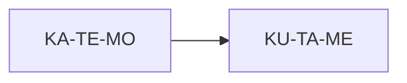
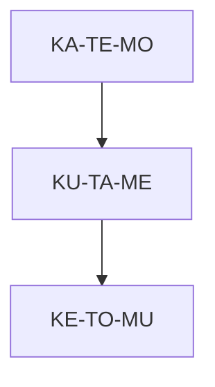
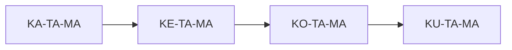
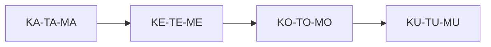

### **SUBIT‑Lingua v3.0 — Structural Diagrams**

This document provides **text‑based and Mermaid‑compatible diagrams** illustrating the geometry of SUBIT‑Lingua:

- the 3‑axis structure  
- the 64‑form cube  
- the 12‑bit word space  
- transitions  
- higher‑order sequences  
- bit‑mapping  
- structural flows  

All diagrams are **render‑safe** for GitHub, Obsidian, and Markdown.

---

# **1. The K/T/M Axes**

SUBIT‑Lingua forms live in a **3‑axis configuration space**:

```
          M-axis (process)
                 ^
                 |
                 |
                 |
                 +--------> T-axis (structure)
                /
               /
              v
        K-axis (internal)
```

Each axis has **4 discrete states** (A/E/O/U), giving:

```
4 × 4 × 4 = 64 forms
```

---

# **2. The 64‑Form Cube (Conceptual Layout)**

The form‑space is a **4×4×4 cube**.  
Each dimension corresponds to one axis:

```
K-axis: A E O U
T-axis: A E O U
M-axis: A E O U
```

A conceptual slice (K = A):

```
K = A layer
+-------------------------------+
| KA-TA-MA | KA-TE-MA | KA-TO-MA | KA-TU-MA |
| KA-TA-ME | KA-TE-ME | KA-TO-ME | KA-TU-ME |
| KA-TA-MO | KA-TE-MO | KA-TO-MO | KA-TU-MO |
| KA-TA-MU | KA-TE-MU | KA-TO-MU | KA-TU-MU |
+-------------------------------+
```

Each layer (K = A/E/O/U) is a 4×4 grid.

---

# **3. Bit‑Mapping Diagram**

Each vowel encodes 2 bits:

```
A = 00
E = 01
O = 10
U = 11
```

A form is:

```
K V1 – T V2 – M V3
```

Bit layout:

```
[ K-bits ][ T-bits ][ M-bits ]
   00        01        10
```

Example:

```
KA‑TE‑MO → 000110
```

---

# **4. Form Encoding Diagram**

```
Form: KA‑TE‑MO

K A → 00
T E → 01
M O → 10

Final bits:
000110
```

---

# **5. Word (12‑bit) Diagram**

A word is a **transition**:

```
Form‑1 – Form‑2
```

Bit layout:

```
[ 6 bits inner ][ 6 bits outer ]
```

Example:

```
KA‑TE‑MO – KU‑TA‑ME
000110   110001
```

ASCII diagram:

```
+----------------------+----------------------+
|   Inner Form (6b)    |   Outer Form (6b)    |
+----------------------+----------------------+
|        000110        |        110001        |
+----------------------+----------------------+
```

---

# **6. Transition Diagram (Mermaid)**



This represents the word:

```
KA‑TE‑MO – KU‑TA‑ME
```

---

# **7. Higher‑Order Sequence Diagram**

A sequence is a **path** through the form‑space:

```
KA‑TE‑MO → KU‑TA‑ME → KE‑TO‑MU
```

ASCII:

```
KA‑TE‑MO
    |
    v
KU‑TA‑ME
    |
    v
KE‑TO‑MU
```

Mermaid:



---

# **8. Bitstream Sequence Diagram**

Sequence:

```
KA‑TE‑MO – KU‑TA‑ME – KE‑TO‑MU
```

Bits:

```
000110 110001 011011
```

Diagram:

```
+--------+--------+--------+
| 000110 | 110001 | 011011 |
+--------+--------+--------+
   F1       F2       F3
```

---

# **9. Axis Sweep Diagrams**

### **K‑axis sweep**

```
KA‑TA‑MA → KE‑TA‑MA → KO‑TA‑MA → KU‑TA‑MA
```



---

### **T‑axis sweep**

```
KA‑TA‑MA → KA‑TE‑MA → KA‑TO‑MA → KA‑TU‑MA
```

---

### **M‑axis sweep**

```
KA‑TE‑MA → KA‑TE‑ME → KA‑TE‑MO → KA‑TE‑MU
```

---

# **10. Diagonal Sweep Diagram**

A diagonal through the cube:

```
KA‑TA‑MA → KE‑TE‑ME → KO‑TO‑MO → KU‑TU‑MU
```



---

# **11. Word‑Space Diagram (Conceptual)**

The 4096‑word space is a **64×64 grid**:

```
           Outer Form (0–63)
        +----------------------------------+
Inner   | F00 F01 F02 ... F63              |
Form    | F00                               |
(0–63)  | F01                               |
        | F02                               |
        | ...                               |
        | F63                               |
        +----------------------------------+
```

Each cell is a **12‑bit transition**.

---

# **12. Summary**

This document provides structural diagrams for:

- the K/T/M axes  
- the 64‑form cube  
- bit‑mapping  
- form encoding  
- word transitions  
- higher‑order sequences  
- axis sweeps  
- diagonal sweeps  
- the 4096‑word space  

These diagrams give a **visual intuition** for the geometry of SUBIT‑Lingua v3.0.

---
