### **SUBIT‑Lingua v3.0 — Visual Motif Atlas**

This document presents the canonical SUBIT‑Lingua motifs **purely as diagrams**.

No semantics.  
No explanations.  
Only structure.

---

# **1. Axis Motifs**

## **1.1 K‑Axis Sweep**

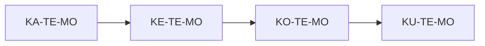

---

## **1.2 T‑Axis Sweep**

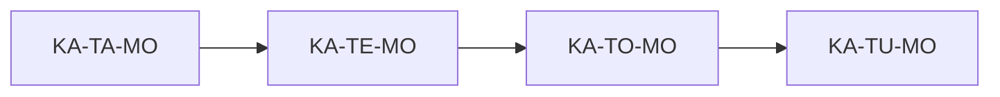

---

## **1.3 M‑Axis Sweep**

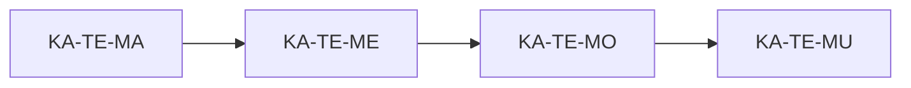

---

# **2. Diagonal Motifs**

## **2.1 Primary Diagonal**

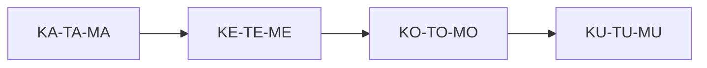

---

## **2.2 Counter‑Diagonal**

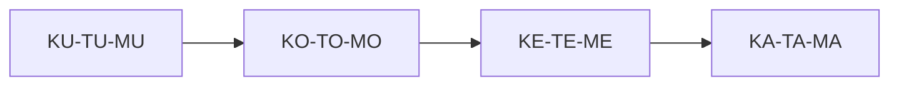

---

## **2.3 Mixed Diagonal**

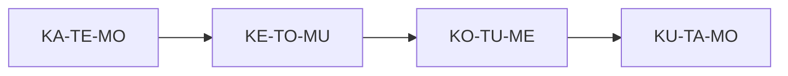

---

# **3. Cyclic Motifs**

## **3.1 4‑Cycle**

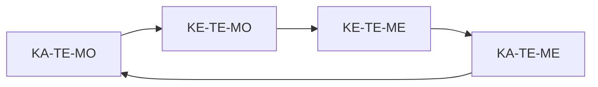

---

## **3.2 8‑Cycle (2×2×2 Subcube)**

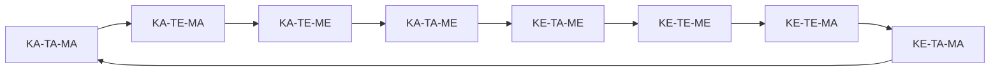

---

## **3.3 Axis‑Alternating Cycle**

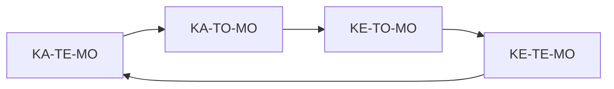

---

# **4. Transition Motifs (Words)**

## **4.1 Single‑Axis Transition**

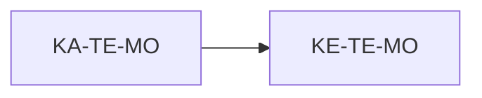

---

## **4.2 Dual‑Axis Transition**


---

## **4.3 Full‑Axis Transition**

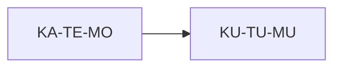

---

## **4.4 Minimal Hamming Transition**

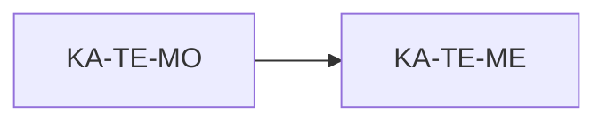

---

## **4.5 Maximal Hamming Transition**

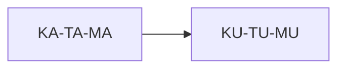

---

# **5. Sequence Motifs**

## **5.1 Linear Sequence**

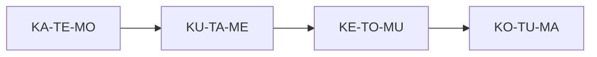

---

## **5.2 Ladder Sequence**

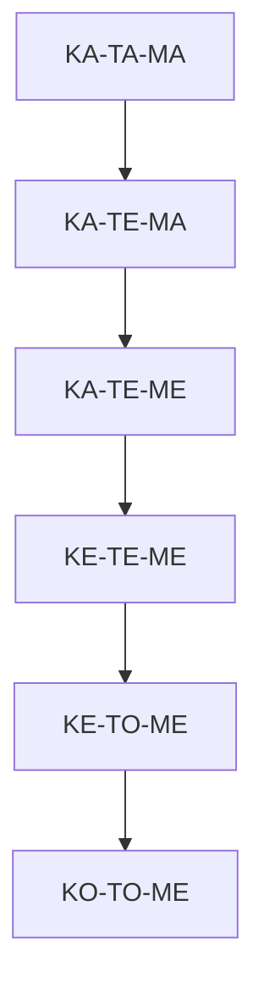

---

## **5.3 Spiral Sequence**

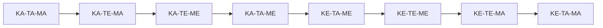

---

## **5.4 Zig‑Zag Sequence**

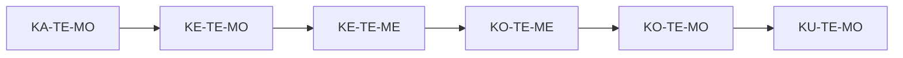

---

# **6. Bit‑Geometry Motifs**

## **6.1 Hamming Sphere (Radius 1)**

```
          000111
             |
000100 -- 000110 -- 000101
             |
          001110
```

---

## **6.2 Hamming Path**

```
000000 → 000001 → 000011 → 000111 → 001111 → 011111 → 111111
```

---

## **6.3 Bit‑Diagonal**

```
00 01 10 → 01 10 11 → 10 11 00 → 11 00 01
```

---

# **7. Program Motifs**

## **7.1 Three‑Stage Program**

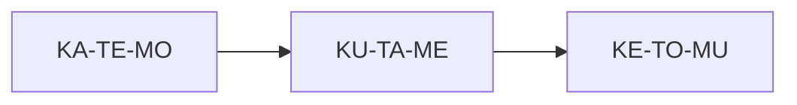

---

## **7.2 Four‑Stage Program**

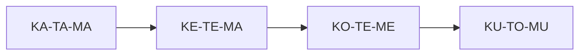

---

## **7.3 Branching Program**

```mermaid
graph TD
    A[KA-TE-MO] --> B[KE-TE-MO]
    A --> C[KA-TO-MO]
```

---

## **7.4 Converging Program**

```mermaid
graph TD
    B[KE-TE-MO] --> A[KA-TE-MO]
    C[KO-TE-MO] --> A
```

---

# **8. Composite Motifs**

## **8.1 Cycle + Sweep**

```mermaid
graph LR
    A[KA-TE-MO] --> B[KE-TE-MO] --> C[KE-TE-ME] --> D[KA-TE-ME] --> A
    A --> E[KA-TO-MO] --> F[KA-TU-MO]
```

---

## **8.2 Diagonal + Ladder**

```mermaid
graph TD
    A[KA-TA-MA] --> B[KE-TE-ME] --> C[KO-TO-MO] --> D[KU-TU-MU]
    D --> E[KU-TU-ME] --> F[KU-TU-MA]
```

---

# **9. Summary**

This atlas contains **pure visual representations** of:

- axis sweeps  
- diagonals  
- cycles  
- transitions  
- sequences  
- spirals  
- zig‑zags  
- Hamming spheres  
- higher‑order programs  
- composite flows  

It is the **visual companion** to `motifs.md`.

---
